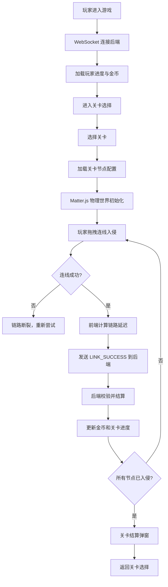

## 1. 产品概述

赛博朋克风格的「黑客网络入侵」2D 策略游戏，玩家通过鼠标拖拽在网络服务器节点之间建立数据连接，逐步入侵对方服务器。游戏融合物理引擎模拟弹性拓扑网络，配合霓虹赛博朋克视觉风格，带来沉浸式黑客体验。

- 核心目标：通过连线入侵所有目标服务器节点，完成关卡挑战
- 目标用户：喜欢策略解谜、赛博朋克题材的休闲玩家
- 产品价值：将网络拓扑概念游戏化，物理弹性效果增强趣味性

## 2. 核心特性

### 2.1 功能模块

1. **游戏主界面**：Canvas 渲染的物理网络拓扑、节点与连线
2. **关卡系统**：多关卡递进难度，每关配置不同的节点布局
3. **入侵机制**：鼠标拖拽连线，链路延迟计算，成功判定
4. **进度系统**：关卡进度、金币奖励、持久化存储
5. **实时同步**：WebSocket 前后端状态同步

### 2.2 页面详情

| 页面名称 | 模块名称 | 功能描述 |
|----------|----------|----------|
| 游戏主界面 | 顶部 HUD | 显示当前关卡、金币数、入侵进度 |
| 游戏主界面 | 物理画布 | Matter.js 驱动的弹性节点网络 |
| 游戏主界面 | 连线交互 | 鼠标按下拖拽、释放判定连线 |
| 游戏主界面 | 结算弹窗 | 关卡完成后的奖励与下一关入口 |
| 关卡选择 | 关卡列表 | 展示已解锁关卡、星级评价 |

## 3. 核心流程

## 4. 用户界面设计

### 4.1 设计风格

- **主色调**：深邃黑 (#0a0a0f) 背景，霓虹红 (#ff0040) 连线，青色 (#00ffff) 节点光晕
- **辅助色**：紫色 (#9d00ff) 敌方节点，绿色 (#00ff88) 已入侵节点
- **视觉风格**：赛博朋克霓虹光效、扫描线、故障艺术、Glow 发光
- **字体**：Orbitron 等宽科技字体，配合像素风装饰
- **节点样式**：半透明发光球体，带脉冲动画和环形扫描线
- **连线样式**：红色数据流，带流动光效和脉冲动画

### 4.2 页面设计概览

| 页面名称 | 模块名称 | UI 元素 |
|----------|----------|---------|
| 游戏主界面 | 顶部 HUD | 霓虹边框面板、数字字体、实时更新 |
| 游戏主界面 | 物理画布 | 深色背景、网格线、扫描线覆盖层 |
| 游戏主界面 | 节点 | 发光球体、脉冲环、状态颜色区分 |
| 游戏主界面 | 连线 | 红色数据流、发光尾迹、脉冲粒子 |
| 结算弹窗 | 弹窗 | 霓虹边框、故障文字动画、金币飞出效果 |

### 4.3 响应式

桌面端优先，Canvas 自适应窗口大小。移动端保留核心玩法，优化触控交互。

### 4.4 动效设计

- 节点脉冲：呼吸式缩放 + 光晕扩散
- 连线流动：数据粒子沿连线流动
- 入侵成功：节点颜色渐变 + 爆炸粒子
- 结算界面：数字滚动计数 + 故障文字效果
