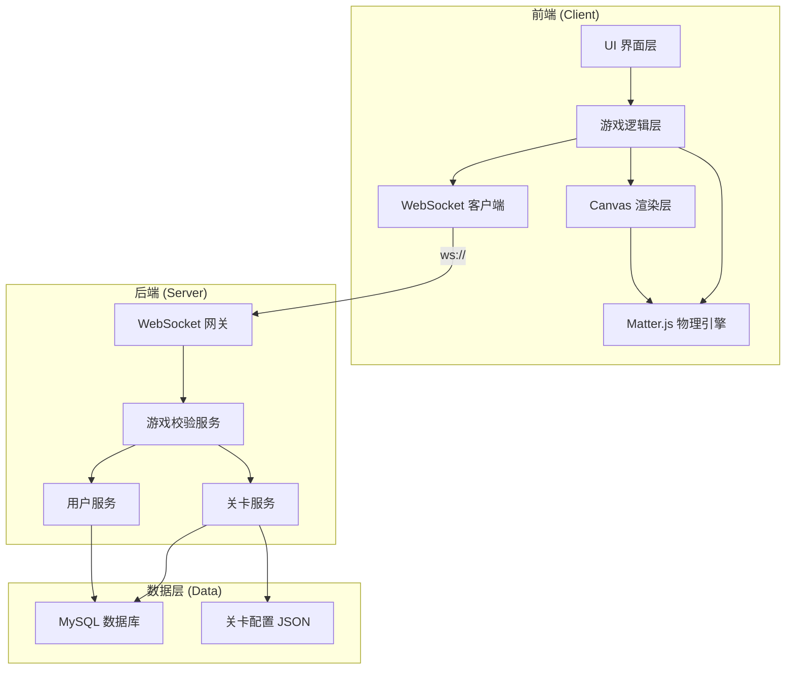
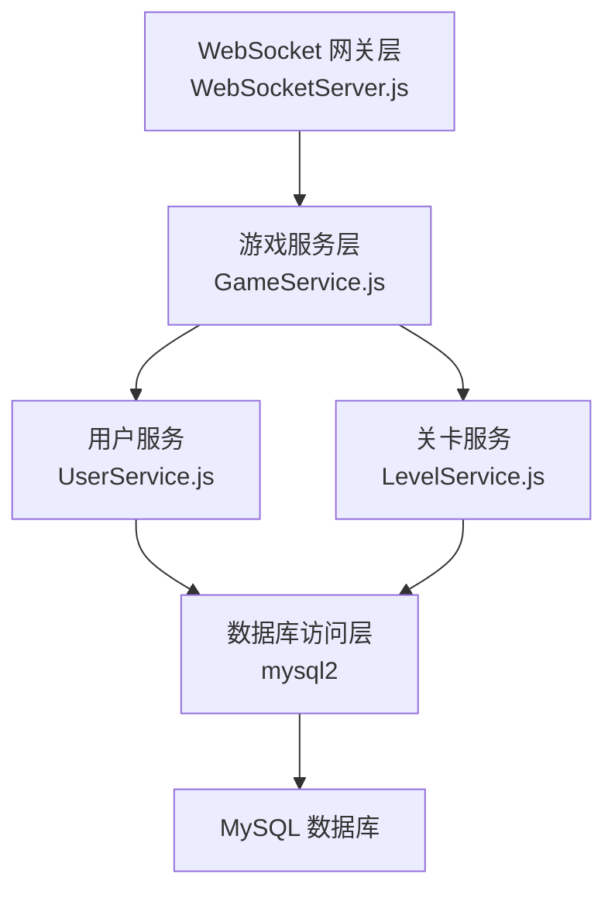
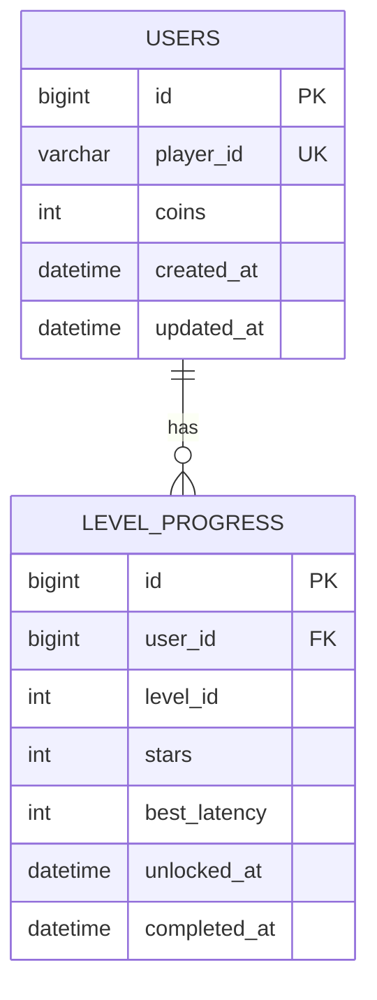

## 1. 架构设计



## 2. 技术选型

- **前端**：原生 HTML5 Canvas + Matter.js 物理引擎
- **构建工具**：Vite
- **后端**：Node.js + Express + ws (WebSocket 库)
- **数据库**：MySQL 8.0+
- **ORM**：mysql2
- **状态管理**：前端自定义 GameState，后端内存会话
- **样式**：原生 CSS + CSS Variables（赛博朋克主题）

## 3. 项目结构

```
cc5/
├── .trae/documents/
│   ├── PRD.md
│   └── TECH_ARCHITECTURE.md
├── public/
│   └── levels/              # 关卡配置 JSON
│       ├── level-1.json
│       ├── level-2.json
│       └── ...
├── src/
│   ├── game/
│   │   ├── GameEngine.js    # 游戏主循环
│   │   ├── PhysicsWorld.js  # Matter.js 物理世界
│   │   ├── NodeRenderer.js  # 节点渲染
│   │   ├── LinkRenderer.js  # 连线渲染
│   │   └── GameState.js     # 游戏状态管理
│   ├── net/
│   │   └── WebSocketClient.js # WS 客户端
│   ├── ui/
│   │   ├── HUD.js           # 顶部信息栏
│   │   └── Modal.js         # 弹窗组件
│   ├── main.js              # 前端入口
│   └── style.css            # 全局样式
├── server/
│   ├── index.js             # 后端入口
│   ├── ws/
│   │   └── WebSocketServer.js # WS 网关
│   ├── services/
│   │   ├── GameService.js   # 游戏校验逻辑
│   │   ├── UserService.js   # 用户服务
│   │   └── LevelService.js  # 关卡服务
│   ├── db/
│   │   ├── index.js         # 数据库连接
│   │   └── schema.sql       # 数据库 schema
│   └── config.js            # 配置文件
├── package.json
└── vite.config.js
```

## 4. WebSocket 消息协议

| 消息类型 | 方向 | 描述 | 数据结构 |
|----------|------|------|----------|
| `PLAYER_JOIN` | C→S | 玩家加入 | `{ playerId }` |
| `PLAYER_STATE` | S→C | 玩家状态同步 | `{ coins, currentLevel, unlockedLevels }` |
| `LEVEL_START` | C→S | 开始关卡 | `{ levelId }` |
| `LEVEL_DATA` | S→C | 关卡数据 | `{ nodes, targetNodes, timeLimit }` |
| `LINK_SUCCESS` | C→S | 连线成功 | `{ fromNode, toNode, latency, levelId }` |
| `LINK_RESULT` | S→C | 连线结果 | `{ success, reward, nodeStatus }` |
| `LEVEL_COMPLETE` | S→C | 关卡完成 | `{ stars, coinsEarned, nextLevel }` |
| `ERROR` | S→C | 错误信息 | `{ code, message }` |

## 5. 后端架构图



## 6. 数据模型

### 6.1 ER 图



### 6.2 DDL

```sql
CREATE TABLE IF NOT EXISTS users (
  id BIGINT AUTO_INCREMENT PRIMARY KEY,
  player_id VARCHAR(64) NOT NULL UNIQUE,
  coins INT NOT NULL DEFAULT 0,
  created_at DATETIME DEFAULT CURRENT_TIMESTAMP,
  updated_at DATETIME DEFAULT CURRENT_TIMESTAMP ON UPDATE CURRENT_TIMESTAMP
);

CREATE TABLE IF NOT EXISTS level_progress (
  id BIGINT AUTO_INCREMENT PRIMARY KEY,
  user_id BIGINT NOT NULL,
  level_id INT NOT NULL,
  stars INT NOT NULL DEFAULT 0,
  best_latency INT DEFAULT NULL,
  unlocked_at DATETIME DEFAULT CURRENT_TIMESTAMP,
  completed_at DATETIME DEFAULT NULL,
  FOREIGN KEY (user_id) REFERENCES users(id),
  UNIQUE KEY uk_user_level (user_id, level_id)
);
```

## 7. 核心技术要点

### 7.1 前端物理引擎
- 使用 Matter.js 的 `Bodies.circle` 创建节点
- 通过 `Constraint` 实现节点间的弹性连接
- 使用 `MouseConstraint` 处理拖拽交互

### 7.2 连线入侵判定
- 鼠标按下记录起始节点
- 拖拽过程中绘制预览连线
- 释放时判定是否命中目标节点
- 成功后计算链路延迟（基于距离和节点数）

### 7.3 链路延迟计算公式
```
latency = baseLatency + (distance / speedFactor) + (hopCount * hopPenalty)
```

### 7.4 后端校验
- 校验关卡是否解锁
- 校验节点连接是否合法（基于关卡配置）
- 校验链路延迟是否在合理范围内
- 计算金币奖励

### 7.5 数据持久化
- 玩家数据实时同步到 MySQL
- 关卡进度垂直存储（每条记录一个关卡）
- 使用事务保证数据一致性
